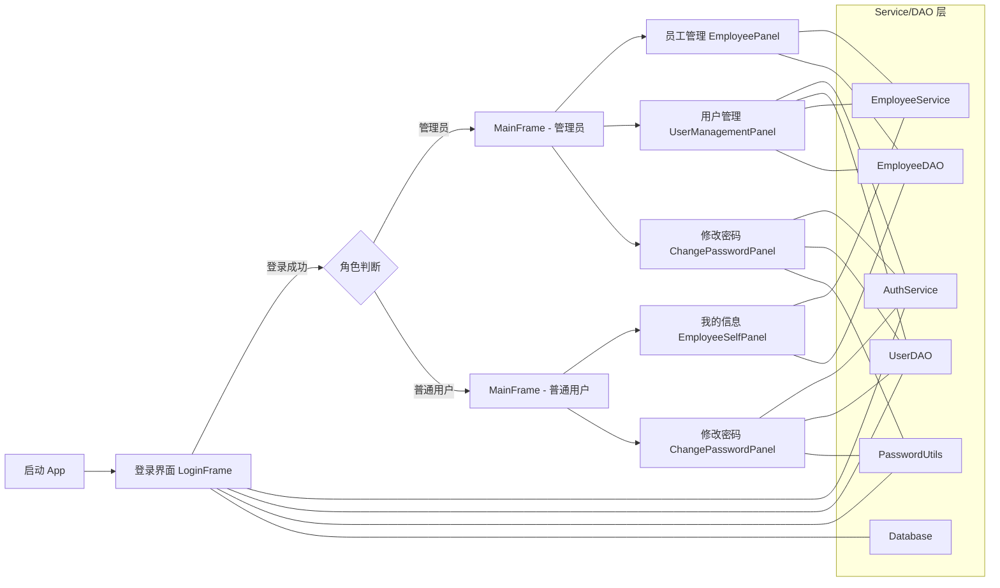

# 公司员工信息管理系统 项目报告

## 一、研究背景
随着企业数字化转型持续推进，人员信息管理的规范化、可视化与安全化成为企业基础治理的重要环节。传统以表格为核心的管理方式难以满足权限分级、数据审计、安全合规与交互易用等要求。本项目以 Java 桌面应用为载体，构建一个现代、美观、工程化的员工信息管理系统，覆盖登录、注册、权限区分、员工信息增删改查等核心场景，并强化账号与员工档案的强绑定关系，确保数据一致性与可追溯性。

## 二、研究意义
- 标准化信息管理：统一员工档案结构、流程，提升数据质量与查阅效率。
- 权限与安全：区分管理员与普通用户，采用 PBKDF2 加盐哈希存储密码，杜绝明文密码风险。
- 工程化落地：采用分层架构（UI/Service/DAO/Security/DB），提升可维护性与可扩展性。
- 教学示范价值：作为面向对象课程大作业，展示良好分层、异常处理、数据库迁移、打包发布与现代桌面 UI 实践。

## 三、需求分析（详细）
- 角色与权限
  - 管理员：用户账号管理（新增/删除/改角色/搜索）、员工信息管理（查看/编辑）、修改自身密码。
  - 普通用户：仅管理自己的员工档案（表单视图，无员工列表），修改自身密码；无法查看或搜索其他员工。
- 账号与员工强绑定
  - 注册新账号时必须同步创建员工档案（姓名默认取用户名，入职日期取注册当天）。
  - 删除账号必须同步删除对应员工档案，保持一对一关系与一致性。
- 员工信息字段
  - 基本信息：姓名（必填）、部门、职位、电话、邮箱、入职日期、薪资。
  - 入职日期：注册时自动生成，普通用户只读，管理员可修改。
  - 薪资：普通用户只读，管理员可修改。
- 安全与合规
  - 密码：PBKDF2WithHmacSHA256 + 随机盐；常量时间比较校验。
  - 数据库：启用外键（PRAGMA foreign_keys = ON），提供唯一索引确保绑定唯一性。
- 可用性
  - 现代 UI：FlatLaf 主题，中文界面、友好提示与表单校验。
- 工程与发布
  - Java 25、Maven、SQLite、Swing；Shade 打包生成可执行胖包。

## 四、系统功能结构（Mermaid 图）

## 五、数据存储设计（数据库表结构）
- 数据库：SQLite；文件名 `hrms.db`（项目根目录）。
- 外键：运行时启用 `PRAGMA foreign_keys = ON`（连接建立后执行）。
- 表结构
  - `users`
    - `id INTEGER PRIMARY KEY AUTOINCREMENT`
    - `username TEXT UNIQUE NOT NULL`
    - `password_hash TEXT NOT NULL`
    - `salt TEXT NOT NULL`
    - `role TEXT NOT NULL`（值域：`ADMIN`/`USER`）
  - `employees`
    - `id INTEGER PRIMARY KEY AUTOINCREMENT`
    - `name TEXT NOT NULL`
    - `department TEXT`
    - `position TEXT`
    - `phone TEXT`
    - `email TEXT`
    - `hire_date TEXT`（ISO-8601 字符串：YYYY-MM-DD）
    - `salary REAL`
    - `user_id INTEGER`（与 `users.id` 强绑定，一对一）
  - 索引与约束
    - 唯一索引：`CREATE UNIQUE INDEX IF NOT EXISTS idx_employees_user_id ON employees(user_id)` 保证每个账号唯一对应一条员工档案。
- 初始化与迁移
  - 首次运行建表与创建默认管理员（`admin/admin123`）。
  - 若旧库缺少 `employees.user_id`，运行时自动 `ALTER TABLE` 增加该列并建立唯一索引（保障兼容与稳定）。
  - 位置：`src/main/java/com/company/hrms/db/Database.java:21`, `src/main/java/com/company/hrms/db/Database.java:48-59`

## 六、系统架构
- 分层设计
  - UI 层：Swing 界面与交互。
  - Service 层：业务逻辑（登录/注册/绑定、密码修改、员工操作）。
  - DAO 层：数据库访问与SQL操作。
  - Security：密码哈希与校验工具。
  - DB：连接管理、初始化与迁移。
- 入口与主题设置
  - `src/main/java/com/company/hrms/App.java:10` 使用 FlatLaf 主题并启动 `LoginFrame`。

## 七、系统功能实现（模块详述）
### 1. 登录模块
- 功能描述：校验用户名与密码，成功后按角色加载对应主界面。
  - 实现：`AuthService.login` 在 `src/main/java/com/company/hrms/service/AuthService.java:10`，结合 `PasswordUtils.verify` 常量时间比较。
- 界面实现：`LoginFrame`（`src/main/java/com/company/hrms/ui/LoginFrame.java:59`）负责表单输入与消息提示。

### 2. 注册模块（强绑定）
- 功能描述：创建用户（唯一用户名、密码≥6位），同步创建员工档案；管理员可创建 ADMIN/USER。
  - 实现：
    - 普通注册：`AuthService.register`（`src/main/java/com/company/hrms/service/AuthService.java:15`），员工 `hire_date` 自动设为当天。
    - 管理员注册：`AuthService.registerWithRole`（`src/main/java/com/company/hrms/service/AuthService.java:28`）。
- 界面实现：
  - 普通用户：`RegisterDialog`（`src/main/java/com/company/hrms/ui/RegisterDialog.java`）。
  - 管理员：在 `UserManagementPanel` 的“新增用户”中触发（`src/main/java/com/company/hrms/ui/UserManagementPanel.java`）。

### 3. 修改密码模块
- 功能描述：校验当前密码与新密码长度，更新密码哈希与盐。
  - 实现：`AuthService.changePassword`（`src/main/java/com/company/hrms/service/AuthService.java:36`）。
- 界面实现：`ChangePasswordPanel`（`src/main/java/com/company/hrms/ui/ChangePasswordPanel.java`）。

### 4. 我的信息（普通用户）
- 功能描述：仅查看并编辑个人员工档案；入职日期与薪资只读，其他可编辑。
  - 实现：`EmployeeService.findByUserId` 读取；`EmployeeService.update` 保存（`src/main/java/com/company/hrms/service/EmployeeService.java`）。
- 界面实现：`EmployeeSelfPanel`（`src/main/java/com/company/hrms/ui/EmployeeSelfPanel.java`）。

### 5. 员工管理（管理员）
- 功能描述：列表展示与编辑所有员工信息；新增与删除由“用户管理”执行以保持强绑定。
  - 实现：`EmployeeDAO.listAll/search/update`（`src/main/java/com/company/hrms/dao/EmployeeDAO.java:15`, `27`, `61`）。
- 界面实现：`EmployeePanel`（`src/main/java/com/company/hrms/ui/EmployeePanel.java`）。

### 6. 用户管理（管理员）
- 功能描述：新增用户（自动创建员工）、删除用户（级联删除员工）、修改角色、搜索用户。
  - 实现：
    - 新增：`AuthService.registerWithRole`（强绑定创建员工）。
    - 删除：`EmployeeService.deleteByUserId` + `UserDAO.deleteById`（`src/main/java/com/company/hrms/ui/UserManagementPanel.java` 调用）。
    - 角色修改：`UserDAO.updateRole`；搜索/列表：`UserDAO.search/listAll`（`src/main/java/com/company/hrms/dao/UserDAO.java:45`, `52`, `63`, `71`）。
- 界面实现：`UserManagementPanel`（`src/main/java/com/company/hrms/ui/UserManagementPanel.java`）。

### 7. 主界面与权限控制
- 功能描述：按角色加载不同标签页并显示当前用户信息。
  - 实现：`MainFrame`（`src/main/java/com/company/hrms/ui/MainFrame.java:21`）根据 `User.isAdmin` 添加相应 Tab。
- 界面实现：`MainFrame` 顶部显示当前用户与角色；Tab 包含员工管理/用户管理/修改密码或我的信息/修改密码。

### 8. 数据库初始化与迁移
- 功能描述：建表、索引、默认管理员、旧库迁移（补齐 `employees.user_id`）。
  - 实现：`Database`（`src/main/java/com/company/hrms/db/Database.java:21`, `26-47`, `48-59`, `60-77`）。
- 界面实现：无界面；在应用启动与连接建立时执行。

### 9. 安全模块
- 功能描述：生成随机盐、PBKDF2 哈希、常量时间比较。
  - 实现：`PasswordUtils`（`src/main/java/com/company/hrms/security/PasswordUtils.java`）。
- 界面实现：无界面；由服务与 DAO 使用。

## 八、构建与部署
- 依赖管理：`pom.xml`（FlatLaf、sqlite-jdbc、shade、exec）。
- 构建：`mvn -DskipTests package`。
- 运行：
  - 可执行胖包：`java -jar target/employee-management-1.0.0-shaded.jar`
  - 直接执行：`mvn exec:java -Dexec.mainClass=com.company.hrms.App`

## 九、测试与验证
- 首次运行自动：建表、创建管理员、旧库迁移补列。
- 管理员登录：进入“员工管理”“用户管理”“修改密码”；创建/删除用户验证强绑定是否生效。
- 普通用户登录：进入“我的信息”“修改密码”；验证只读字段不可编辑；修改其余字段可保存。
- 错误处理：登录失败/注册失败/保存失败等消息提示，便于定位问题。

## 十、安全性设计
- 密码安全：PBKDF2WithHmacSHA256 + Base64 存储；常量时间比较防止时序攻击。
- 账号唯一性：用户名唯一索引。
- 档案绑定：`employees.user_id` 唯一索引，确保一对一。
- 外键与约束：启用外键支持，减少孤儿数据风险（当前通过服务层级联删除保障一致性）。

## 十一、可扩展性与后续工作
- 管理员重置他人密码与密码策略（复杂度/历史校验）。
- 数据导入/导出（CSV/Excel）。
- 审计日志（操作人、时间、动作、前后值）。
- 更完善的数据校验（邮箱/电话/日期选择器）。
- 主题切换与多语言支持。

## 十二、使用指南
- 管理员默认账号：`admin / admin123`。
- 普通用户注册后自动创建员工档案，入职日期为注册当天；管理员可在“员工管理”中调整入职日期或薪资。
- 任何删除账号的操作将同步删除员工档案。

## 十三、结论
本系统在角色权限、强绑定一致性与安全性方面进行了完整设计与实现，具有现代化的桌面 UI 与工程化的项目结构，满足课程“大作业”全面功能要求，并为后续功能扩展提供了稳定基础。
